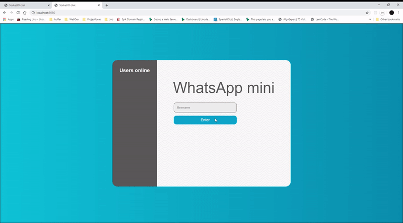

# ChatHub💬
## A real-time messaging application powered by Socket.IO, NodeJS and Express
# Goals 🥅:
- Broadcast a message to connected users when someone connects or disconnects. ✅
- Add support for nicknames.✅
- Clean & familiar UI ✅
- add 'user is typing' functionality ✅

# Small Demo of ChatHub 

### How to run:
- run `npm install`
- cd to /server
- run `node app.js`
- visit `localhost:8080` in your browser
